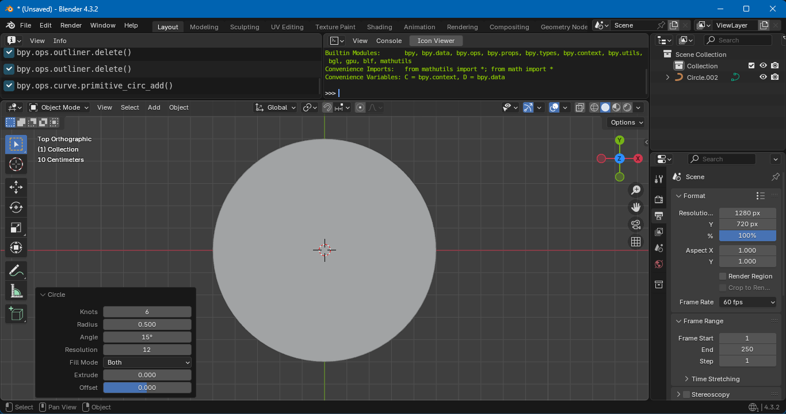

# Blender Curve Geometry

This repository houses Python scripts to create basic 2D geometry with Bezier curves in [Blender](https://www.blender.org/). At time of writing, this includes

1. A Bezier circle that lets you specify the number of knots and their angular offset. The circle defaults to a filled 2D curve.

2. A Bezier arc that lets you specify a start and stop angle. There is a choice between stroke, chord and pie type arc.

These scripts were tested with Blender version 4.3.2.

🇹🇼 🇺🇦