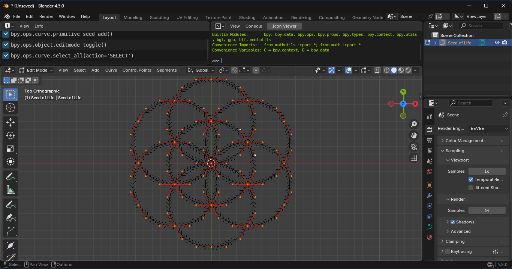

# Blender Curve Geometry

This repository houses Python scripts to create basic 2D geometry in [Blender](https://www.blender.org/). See below for screen captures of available scripts.

To install, go to Edit > Preferences. Click on Add-ons in the lefthand column. Click on the arrow in the top-right corner. Select Install from Disk in the drop down menu.

These scripts were tested with Blender version 4.4.3.

### Bezier Curves:

An arc between a start and stop angle.

A circle with a variable knot count.

An egg.

An infinity loop, or [lemniscate of Bernoulli](https://en.wikipedia.org/wiki/Lemniscate_of_Bernoulli).

A [Reuleaux triangle](https://en.wikipedia.org/wiki/Reuleaux_triangle).

A segmented line.

A [polar grid](https://en.wikipedia.org/wiki/Polar_coordinate_system).

A star.

A [Seed of Life](https://en.wikipedia.org/wiki/Overlapping_circles_grid).

A [Tudor arch](https://en.wikipedia.org/wiki/Four-centred_arch).

A [vesica piscis](https://en.wikipedia.org/wiki/Vesica_piscis), the intersection of two circles.
  
### Meshes:

An arc.

An egg (2D).

An infinity loop.

A polar grid.

A Reuleaux triangle.

A segmented line.

A star.

A tudor arch.

A vesica piscis.

🇹🇼 🇺🇦